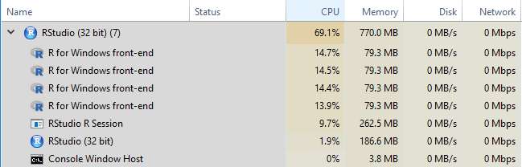

```{r setup, include=FALSE}
knitr::opts_chunk$set(echo = TRUE)
```

## Necessary Packages

```{r warning=FALSE, message=FALSE}
#install.packages("doParallel",dependencies=TRUE)
library(doParallel)
```

## Recall: For loops in R

We can use a for loop in R to apply the same set of instructions iteratively to each object in a group (e.g. each value in a vector, each row in a data.frame, each file path in a directory etc.)

The syntax for a loop is:

```
for (<iterator_name> in <list>){
<do something using iterator_name>
}
```

For example:

```{r}
for (x in 1:15){
  if(x%%2==0){
    print(paste(x,"is even"))
  }
}
```


## Time

Some loops can take a long time to run - either the code applied in each iteration is complex, or the we're applying the code over a very large number of iterations.

To figure out how long our code is taking, we'll use the built-in `proc.time()` function to print the current system time.

```{r}
start <- proc.time()
prime <- c(2)
for (x in 3:5000){
  if(all(x%%2:(x-1)!=0)){
    prime <- c(prime,x)
  }
}
print(length(prime))
print(proc.time()-start)
```

There are many other methods and packages for timing processes in R, but `proc.time()` minus the start time is one of the most flexible and basic. From the documentation (`?proc.time`):

The definition of user and system times is from your OS. Typically it is something like

* The user time is the CPU time charged for the execution of user instructions of the calling process. 
* The system time is the CPU time charged for execution by the system on behalf of the calling process.

The elapsed time is time as we would percieve it - the actual time between the two `proc.time()` calls.

Now we can quantify how long any of our loops is taking, or try to predict how long a large batch may take based on a small (ideally randomly sampled) piece.

## Parallel Computing

### Benefits

If we have a long-running loop, one of the easiest ways to speed up the process on most computers is to use more of the computer.  Most modern laptops and desktop processors have more than one actual (hardware) processing core, and perhaps even more logical (software) processing cores.  By default, R is only using one of these cores.

Parallel computing involves splitting a task up so different parts can be run simultaneously on separate cores, then brought back together at the end.  Doubling the number of cores used should nearly (but not quite) halve the run time needed.

### `foreach` and `doParallel`

The `doParallel` package helps set up a backend for parallel computing, giving us a way to start up and organize "workers" for each of the cores we want to use.  This package also includes the `foreach` functionality to write loops using these parallel workers.

Example from [Getting Started with doParallel and foreach](https://cran.r-project.org/web/packages/doParallel/vignettes/gettingstartedParallel.pdf)

First we need to set up a backend for parallel computing.  Let's check how many cores are available:

```{r}
library(doParallel)
detectCores()
```

It's usually not a good idea to use ALL of the cores available since that will use all of your computer's resources.  Instead we'll use six cores for this example.

```{r}
registerDoParallel(6)
```

In the Windows Task Manager, these will appear as "R for Windows front-end" objects as below.



### Basic loop

```{r}
data(iris)
x <- iris[which(iris[,5] != "setosa"), c(1,5)]
trials <- 10000

start <- proc.time()
outdf <- data.frame()
r <- for (i in 1:trials){
  ind <- sample(100, 100, replace=TRUE)
  result1 <- glm(x[ind,2]~x[ind,1], family=binomial(logit))
  outdf <- rbind(outdf,coefficients(result1))
}

base_loop <- proc.time()-start
```

### `%do%` loop - `foreach` notation, but *not parallel*

```{r}
start <- proc.time()
r <- foreach(icount(trials), .combine=rbind) %do% {
  ind <- sample(100, 100, replace=TRUE)
  result1 <- glm(x[ind,2]~x[ind,1], family=binomial(logit))
  coefficients(result1)
}
do_loop <- proc.time()-start
```

The `foreach` format requires slightly different syntax than base R loops.  

First and foremost, our loop generates a result directly, which we assign to `r` here.  At the end of each loop we simply call the result we want to save: `coefficients(result1)`.  Each iteration will generate a different result, which `foreach` combines into a single object using the method in the `.combine` parameter.  In this case, `rbind` will use each set of coefficients as a row, bound together into a data.frame.

### `%dopar%` adds parallelization

When we change `%do%` to `%dopar%`, `foreach` will use the cluster we set up earlier with `registerDoParallel`.  Otherwise, the function will behave just like the `%do%` loop above!

```{r}
start <- proc.time()
r <- foreach(icount(trials), .combine=rbind) %dopar% {
  ind <- sample(100, 100, replace=TRUE)
  result1 <- glm(x[ind,2]~x[ind,1], family=binomial(logit))
  coefficients(result1)
}
dopar_loop <- proc.time()-start
```

### Results

```{r}
print(rbind(base_loop,do_loop,dopar_loop)[,1:3])
```

Notice that the `%do%` loop takes slightly longer than the base R loop.  Furthermore, the `%dopar%` loop is only about twice as fast as the base R loop, even though it had six times as much computing power!  

Unfortunately, parallel computing always loses some "overhead" time to setting up the workers and bringing all of the data together at the end.  In many cases, relatively quick loops like this aren't worth running parallel. However, the overhead costs are relatively stable - as the task gets bigger and bigger the speed benefit increases.

### Read more

[Getting started with doParallel and foreach](https://cran.r-project.org/web/packages/doParallel/vignettes/gettingstartedParallel.pdf)