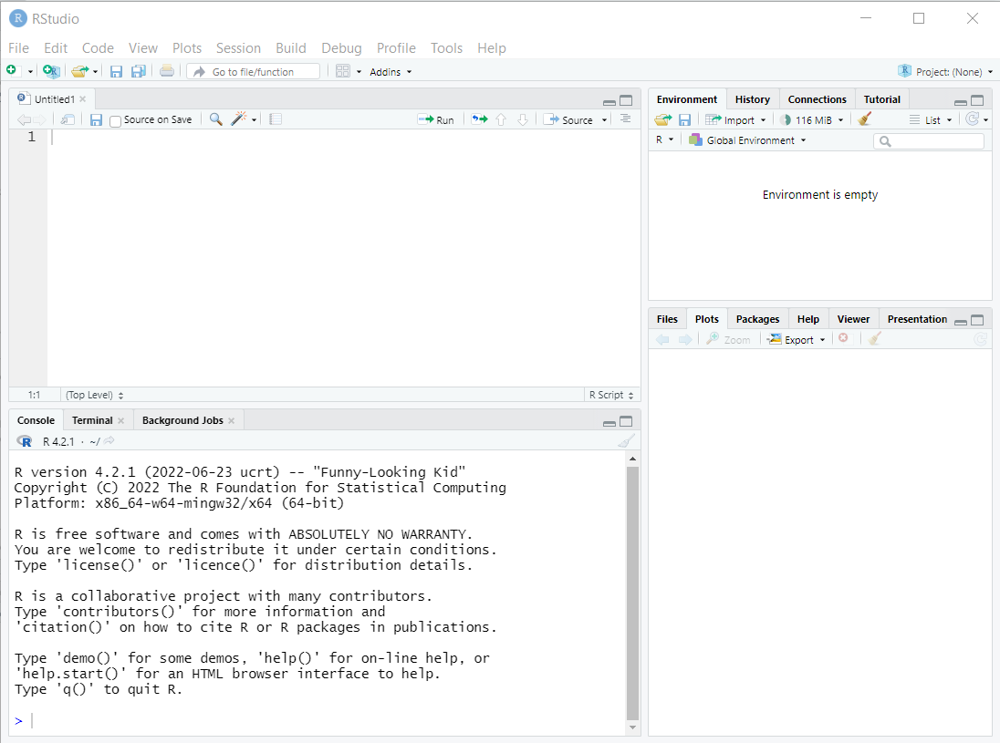
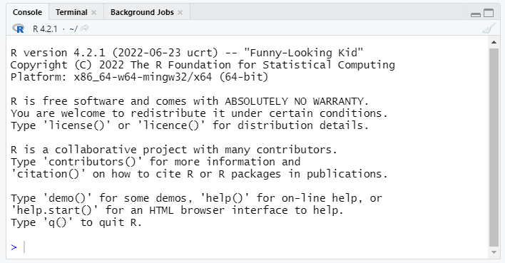
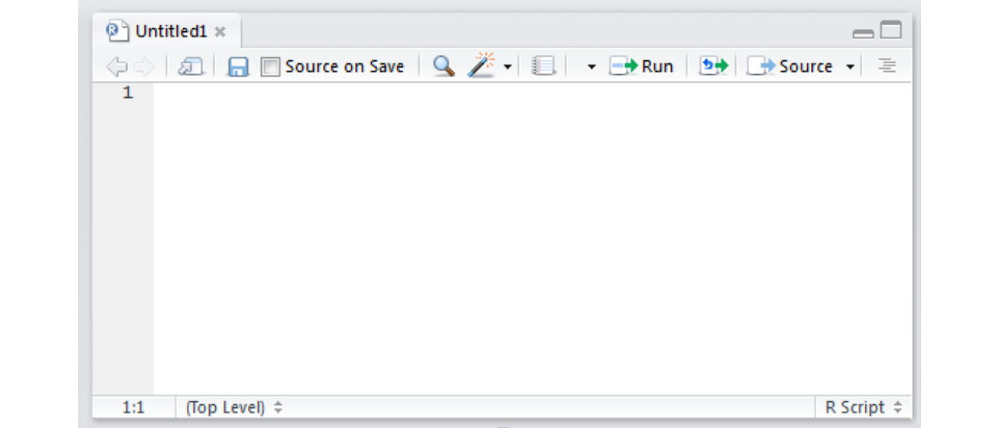
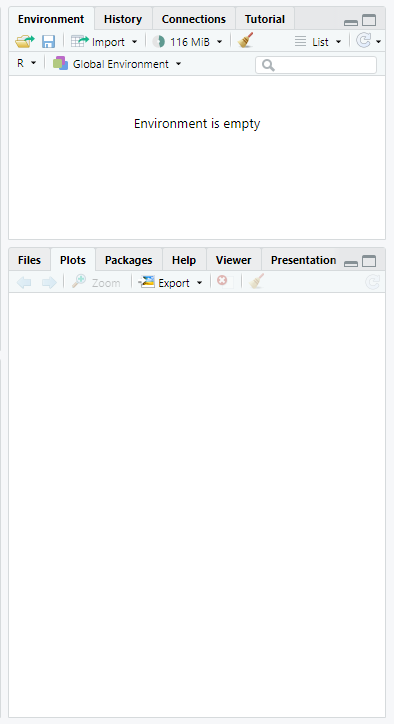

```{r echo=FALSE}
# Developed by Nuvan Rathnayaka (Fall 2018)
# Updated by Matt Jansen (Spring 2019)
```


## What's an Open Lab?

Open labs are (mostly) unstructured workshops designed to help you learn R. Each week brief (30-45 minutes) instruction will be provided, followed by time to practice, work together or alone on learning other topics or your own projects, ask questions and get help. Participants can join the lab any time during the session, and are welcome to work on unrelated projects.

The Open Labs model was established by our colleagues at Columbia University, and we've adapted it to UNC. Our goal is to connect researchers and foster a community for R users on campus.

### Why R?

R is widely used in statistics and has become quite popular in the biomedical and social sciences over the last decade. R can be used as either a programming language (like Python or Java) or as a standard statistical package (like Stata, SAS, or SPSS).

R is open source and free to use for any purpose.  This has clear advantages and a few disadvantages:

Advantages

* Free!
* Portable (Windows, macOS, Linux)
* [Interactive visualization](https://shiny.rstudio.com/gallery/)
* [Reproducible reports](https://rmarkdown.rstudio.com/gallery.html)
* Active user base
    + Blogs, forums, StackOverflow, etc. provide many avenues of support
    + Many new methods (e.g. [lasso regression](https://web.stanford.edu/~hastie/glmnet/glmnet_alpha.html), [Bayesian  multilevel modeling](https://cran.r-project.org/web/packages/brms/vignettes/brms_phylogenetics.html), and [deep learning](https://tensorflow.rstudio.com/learn/gallery.html)) quickly appear as R libraries

Disadvantages

* No commercial support
    + R is available free as is.  If something doesn't exist or doesn't work the way you think it should you can wait for someone else to (hopefully) build it, or it's up to you
    + No commercial hotline for help
    + Support and libraries from other users varies by popularity of method/area of study.

### Learning objectives for the semester

R is a big tent that supports a variety of programming styles and tasks, so we can't possibly cover all of it. We will focus instruction on using R for analyzing data. If you are interested in software development in R, you can use the unstructured time for help with that. We'll also provide links to some great online resources for software development in R.

We are going to focus on the [Tidyverse](https://www.tidyverse.org/) family of R packages for data analysis.  The authors of the Tidyverse have also written a free ebook, [R for Data Science](http://r4ds.had.co.nz/). We will not follow this book exactly, but for each of our workshops we will announce the corresponding chapters from the book, so you can have an additional perspective and practice on what we are teaching.

This workshop **does not** aim to give a comprehensive introduction to all aspects of R.

If you don't have any R experience, don't worry!  The Open Labs can provide support and a community to help you learn, **but** you may need to work outside the Open Labs to learn some of the basics.  

We also hope to empower you to become a self-sufficient R user, so we'll be showing you examples of how to troubleshoot and debug R code.  Those of us who have used R regularly for years still troubleshoot, refer to documentation, and google error codes all the time!

## Setup: R, R Studio

This introductory workshop aims to:

* Install R and R Studio if you haven't already
* Briefly familiarize or re-familiarize you with some of the most important elements of R
    + RStudio interface
    + Tidyverse library
    + Graphics using ggplot2
    + Data types
* [R for Data Science Chapters 1-3](http://r4ds.had.co.nz/introduction.html)

### Installation

1) Download R at https://cran.r-project.org/

- For macOS, make sure to install **XQuartz** as well: https://www.xquartz.org/ 


2) If possible, install the additional R developer tools. This can help in the future because some libraries require these. If your computer is not updated to the latest version of your operating system, this can get a little hairy, so don't worry if you can't get this done today.

- For Windows: https://cran.r-project.org/bin/windows/Rtools/

- For macOS: https://cran.r-project.org/bin/macosx/tools/


3) Download R Studio at https://www.rstudio.com/products/rstudio/download/#download


### R Studio orientation



#### Panes

R Studio shows four panes by default.  The two most important for writing, testing, and executing R code are the console and the script editor.

##### Console (bottom left)


The console pane allows **immediate execution** of R code.  This pane can be used to experiment with new functions and execute one-off commands, like printing sample data or exploratory plots.

Type next to the `>` symbol, then hit Enter to execute.

##### Script Editor (top left)



In contrast, code typed into the script editor pane **does not automatically execute**.  The script editor provides a way to save the essential code for your analysis or project so it can be re-used or referred to for replication in the future.  The editor also allows us to save, search, replace, etc. within an R 'script.' (This is much like the difference between using a Stata .do file and the main Stata window!)

The script should contain every necessary step in a data analysis; you should aim to be able to open and run a script in a new R session without relying on anything you've only run in the console.  In contrast, the console is a great place to test code or run one-off checks of the data.

R Studio provides a few convenient ways to send code from the script editor to be executed in the console pane.

* The **Run** button at the top right of the script editor pane provides several options.
* One of the most useful is the **CTRL+Enter** (PC) or **CMD+Enter** (Mac) shortcut to execute whichever lines are currenly selected in the script editor
    + If no complete lines are selected, this will execute the line where the cursor is placed.

##### Other Panes



The other panes provided in R Studio are provided to make some coding tasks easier.  Some users hide these windows as they are less essential to writing code.  Some of the most useful panes are:

* **Environment** (top): Lists all objects and datasets defined in your current R session.

* **Plots** (bottom): Displays plots generated by R code.

* **Help** (bottom): Displays html format help files for R packages and functions 

* **Files** (bottom): Lists files in the current working directory (more on this later!)


### Loading the tidyverse

First, we need to load the tidyverse package. (Note, the terms package and library are interchangeable). You can install the library using the install.packages command or through the Packages tab on the lower right pane. Once you have it installed, you can load this library with the following code:

```{r tidyverse, warning=FALSE}
#install.packages("tidyverse")
library(tidyverse)
```

You only have to install a package once, but you'll need to load it each time you start a new R session.

**Note:** `install.packages("tidyverse")` is a great candidate to run in the console window, since you only need to run it once and it won't be needed again.  `library(tidyverse)` has to be run before using the tidyverse package, so it is probably necessary in your script! 

## A quick example

For simplicity, today we'll be working with datasets that are included with Base R.
```{r find a dataset}
data()
```

From the Packages pane, we can click on the datasets package, which will take us to the help page:

Now we can read up on the available datasets.

Let's start exploring the New York Air Quality dataset
```{r airquality explore}
data(airquality)
head(airquality)
tail(airquality)
summary(airquality)
```

### Interlude: What is airquality? `data()`? `head()`? `summary()`?

Unlike other popular statistical software, R is an object oriented programming language, similar to other popular languages such as Java, Python, Ruby, or C++.

`airquality` is an **object**. `data()`, `head()`, and `summary()` are **functions**. We'll learn more about these as we go along, but for now, it may be useful to think of objects as nouns and functions as verbs.

### Plotting with ggplot2

```{r first ggplot}
ggplot(airquality, aes(x = Temp, y = Ozone)) + 
  geom_point()
```

ggplot has a modular structure, so it's easy to modify plots. Let's add a best fit linear regression line.

```{r ggplotv2}
ggplot(airquality, aes(x = Temp, y = Ozone)) + 
  geom_point() + geom_smooth(method="lm")
```

Let's change that to a loess (a locally-weighted version of linear regression).

```{r ggplotv3}
ggplot(airquality, aes(x = Temp, y = Ozone)) + 
  geom_point() + geom_smooth(method="loess")
```

What if we want to plot the data over time? We'll have to do a little work.

### Creating a date variable

I don't remember how to create dates in R, so let's do a little searching.

Yes, I'm live googling in a class. [The pros do it all the time](https://medium.com/make-better-software/against-the-whiteboard-f1df0013954f). You should too.

This [stackoverflow.com page](https://stackoverflow.com/questions/26334763/merge-three-different-columns-into-a-date-in-r) suggests a solution.

First, we'll create a new column in the airquality dataframe for the year.

```{r year}
airquality$Year <- "1973"
```
There's a lot going on in that one line of code.  Let's dissect it.

* We are using the `$` operator. This is a way to access individual columns of a dataframe.

* We are dealing with a brand new data type, character. This is indicated by the quotation marks around `"1973"`.

* We are using the assignment operator `<-`, which can be read as "assign the character value 1973 to the Year column of the airquality dataframe."

Now we can use the code snippet we found on stackoverflow.

```{r create new data}
airquality$Date <- as.Date(with(airquality, paste(Year, Month, Day, sep="-"), "%Y-%m-%d"))
```

Let's figure out why this works using R's help system:

* `?` followed by a function name will bring up the documentation for that function
* `??` will search for any funtions related to the term supplied

Here we know that `as.Date` is a function, so we'll use a single question mark.

```{r help1, eval=FALSE}

?as.Date
#equivalent to help("as.Date")
#also try ??date
```

So `as.Date()` is a function that can take a character representation of a date and convert it into a Date object (or vice versa).

```{r help2, eval=FALSE}
?with
```

`with()` is a function that allows us to reference elements of data frame without having to type the data frame's name repeatedly. This suggests we could get the same results as above with:

```{r create new data 2}
airquality$Date2 <- as.Date(paste(airquality$Year, airquality$Month, airquality$Day, sep="-"), "%Y-%m-%d")
```

We can check the dataframe viewer to see that the results are indentical or we can use the `all.equal()` function.

```{r help3, eval=FALSE}
?paste
```

`paste()` lets us stick a bunch of character values together.

Finally, we can create a plot.

```{r second ggplot, error=TRUE, fig.height=0.1}
ggplot(airquality, aes(x=Date, y=ozone)) +
  geom_point() + geom_smooth(method="loess") + theme_bw()
```

Oops. Let's try that again.

```{r second ggplot2}
ggplot(airquality, aes(x=Date, y=Ozone)) +
  geom_point() + geom_smooth(method="loess") + theme_bw()
```

### Other geoms: `geom_boxplot()` and `geom_jitter()`


```{r boxplot}
ggplot(airquality, aes(x = Month, y = Ozone)) +
        geom_boxplot()

```

Looks like I left out something `geom_boxplot()` needs. Time for google!

```{r boxplot2}
ggplot(airquality, aes(x = Month, y = Ozone, group=Month)) +
        geom_boxplot()

```

Let's fix up the x-axis labels.

```{r month}
airquality$MonthFac <- factor(airquality$Month,labels = c("May", "Jun", "Jul", "Aug", "Sep"))
ggplot(airquality, aes(x = MonthFac, y = Ozone)) +
        geom_boxplot()
```

Getting there, let's try a few more tweaks.

```{r month2}

ggplot(airquality, aes(x = MonthFac, y = Ozone)) +
        geom_boxplot() + xlab("Month") + ylab("Mean Daily Ozone (ppb)") + ggtitle("New York City Air Quality")  + theme_bw()
```

What if I want to see the original data and the boxplots?

```{r month3}

ggplot(airquality, aes(x = MonthFac, y = Ozone)) +
        geom_boxplot() + xlab("Month") + ylab("Mean Daily Ozone (ppb)") + ggtitle("New York City Air Quality")  + theme_bw() + geom_point()
```

That's hard to read, so let's try using `geom_jitter()`

```{r month4}

ggplot(airquality, aes(x = MonthFac, y = Ozone)) +
        geom_boxplot() + xlab("Month") + ylab("Mean Daily Ozone (ppb)") + ggtitle("New York City Air Quality")  + theme_bw() + geom_jitter()
```

Maybe I can make the jittering a bit more compact. Time for the R help system, which we can access through the RStudio Help pane.

```{r month5}

ggplot(airquality, aes(x = MonthFac, y = Ozone)) +
        geom_boxplot() + xlab("Month") + ylab("Mean Daily Ozone (ppb)") + ggtitle("New York City Air Quality")  + theme_bw() + geom_jitter(width=0.2)
```

### Facets

```{r facet}
ggplot(airquality, aes(x=Temp, y=Ozone)) + geom_point() + geom_smooth(method = "lm") + facet_grid(. ~ Month) + xlab("Maxiumum Daily Temperature (degrees Fahrenheit") + ylab("Mean Daily Ozone (ppb)") + ggtitle("New York City Air Quality") + theme_bw()
```

## Resources

#### Beginners

Review today's material by reading [R for Data Science Chapters 1-3](http://r4ds.had.co.nz/introduction.html).  Try the exercises in Chapter 3.

Next week, we'll be covering the material in Chapters 4, 6, and 8 if you'd like to look ahead!

#### Other Resources

**Quick References**

[Tidyverse Cheatsheets](https://www.rstudio.com/resources/cheatsheets/)

[Quick-R for Base R](https://www.statmethods.net/)


**Useful R Packages:**

[CRAN Task Views](https://cran.r-project.org/web/views/)

[Quick list of useful packages](https://support.rstudio.com/hc/en-us/articles/201057987-Quick-list-of-useful-R-packages)


**Advanced R Books:**

[ggplot2](http://had.co.nz/ggplot2/)

[Advanced R](http://adv-r.had.co.nz/)

[R packages](http://r-pkgs.had.co.nz/)

[Efficient R](https://csgillespie.github.io/efficientR/)


**Statistical Modeling Textbooks:**

[An Introduction to Statistical Learning](http://faculty.marshall.usc.edu/gareth-james/ISL/)

[Regression Modeling Strategies](https://www.springer.com/us/book/9783319194240)

[Statistical Rethinking](https://xcelab.net/rm/statistical-rethinking/)


**Misc:**

https://github.com/ujjwalkarn/DataScienceR


## Feedback
[Let us know what you think of this lesson!](https://unc.az1.qualtrics.com/jfe/form/SV_8e1zRY2rlFUYBMx)
