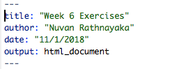
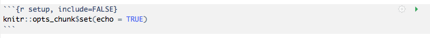
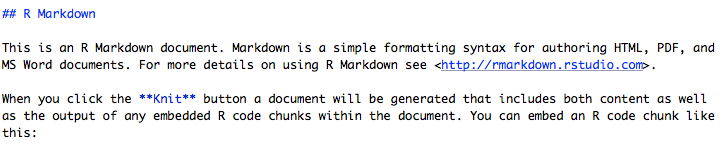

```{r knit, include=FALSE}
knitr::opts_chunk$set(echo = TRUE)
library(tidyverse)
```


## Data and other downloads
[US Cheese Consumption](data/clean_cheese.csv)

Cleaned data courtesy of the [Tidy Tuesday project](https://github.com/rfordatascience/tidytuesday)


## Today

This workshop aims to cover:

* Review of Previous Topics
    + Starting a New Project
    + Loading the tidyverse
    + Importing Data
    + Graphics using ggplot
    + Data transformations
    + Summarizing Data

* Data Transformations
    + Reproducible Reports using R Markdown
    
* [Chapter 27](https://r4ds.had.co.nz/r-markdown.html)

&nbsp;

## Start a New Project in R

It is best practice to set up a new directory each time we start a new project in R. To do so, complete the following steps:

1. Go to **File > New Project > New Directory > New Project**. 
2. Type in a name for your directory and click **Browse**. Be sure to pick a place for your directory that you will be able to **find later**.
3. Go to **Finder** on Mac or **File Explorer** on PC and find the directory you just created.
4. Inside your project directory, create a new folder called **data**.
5. Download or copy the **data file** (clean_cheese.csv) into the data folder.


&nbsp;

## Motivation
R Markdown provides a straightforward way to create reports that combine code and the output from that code with text commentary. This allows for the creation of automated, reproducible reports. R Markdown can knit together your analysis results with text and output it directly into HTML, PDF, or Word documents. In fact, we have been using R Markdown to generate the webpage for all of our R Open Labs workshops!

&nbsp;

## RMarkdown Structure

R Markdown has three components.

1. An (optional) header in a language called YAML. This allows you to specify the type of output file and configure other options.
2. R code chunks wrapped by ` ``` `
3. Text mixed with simple formatting markup.

To create a new R Markdown document (.Rmd), select File -> New File -> R Markdown.

You will have the option to select the output: we’ll use the default HTML for this workshop.
Give the document a title and enter your name as author: this will create the header for you at the top of your new .html page!
RStudio will create a new R Markdown document filled with examples of code chunks and text.


## Header

At the top of the page is the optional Yet Another Markup Language (YAML) header. This header is a powerful way to edit the formatting of your report (e.g. figure dimensions, presence of a table of contents, identifying the location of a bibliography file).

## Code Chunks

R code chunks are surrounded by ` ``` `. Inside the curly braces, it specifies that this code chunk will use R code (other programming languages are supported), then it names this chunk "setup".  Names are optional.

After the name, you specify options on whether you want the code or its results to be displayed in the final document. For this chunk, the `include=FALSE` options tells R Markdown that we want this code to run, but we do not want it to be displayed in the final HTML document. The R code inside the chunk `knitr::opts_chunk$set(echo = TRUE)` tells R Markdown to display the R code along with the results of the code in the HTML output for **all** code chunks below.

## Formatted Text


This is plain text with simple formatting added. The `##` tells R Markdown that "R Markdown" is a section header. The ``**`` around "Knit" tells R Markdown to make that word **bold**.

The RStudio team has helpfully condensed these code chunk and text formatting options into a [cheatsheet](https://www.rstudio.com/wp-content/uploads/2015/02/rmarkdown-cheatsheet.pdf).

You can get pretty far with options in the R Markdown cheatsheet, but R Markdown is a very powerful, flexible language that we do not have time to fully cover. More detailed references are:
  
https://www.rstudio.com/wp-content/uploads/2015/03/rmarkdown-reference.pdf

https://bookdown.org/yihui/rmarkdown


## Generating the HTML document

Click the **Knit** button, and R Studio will generate an HTML report based on your R Markdown document.

Let's try creating an R Markdown document to explore the US cheese consumption data and review what we learned in weeks 1-3.

## Data Import
```{r import}
consumption <- read_csv("data/clean_cheese.csv")
```

## Useful functions for exploring dataframes

Include one of the following in your document.  We've used `eval = FALSE` here to prevent this code chunk from running!

```{r misc, eval=FALSE}
head(consumption)
tail(consumption)
summary(consumption)
```

## Tables and `knitr::kable`

By default, R Markdown will display tables the way they appear in the R console. We can use `knitr::kable function` to get cleaner tables.

```{r kable}
knitr::kable(head(consumption), caption = "The first six rows of the cheese consumption data")
```


## Adding a new variable
We've covered two ways to add a new variable to a dataframe.

**Note:** R allows non-standard variable names that include spaces, parentheses, and other special characters. The way to refer to variable names that contain wonky symbols is to use the backtick symbol `` ` ``, found at the top left of your keyboard with the tilde ` ~ `.

The base R way covered in lesson 1 using the `$` operator and `with()` function

```{r ratio1, error=TRUE}
#Base R way, covered in lesson 1
consumption$amer_ital_ratio <- with(consumption, `Total American Cheese` / `Total Italian Cheese`)
```

Oops. Better check the variable names.

```{r ratio2}
consumption$amer_ital_ratio1 <- with(consumption, `Total American Chese` / `Total Italian Cheese`)
```

The tidyverse way covered in lesson 3 using the `mutate()` function

```{r ratio3}
#Tidyverse way, covered in lesson 3
consumption <- mutate(consumption, amer_ital_ratio2 = `Total American Chese` / `Total Italian Cheese`)
```

## Selecting Columns
```{r select}
consumption <- select(consumption, Year, Cheddar, Mozzarella, `Cream and Neufchatel`)

```

## Renaming Columns
```{r rename}
consumption <- rename(consumption, Cream_and_Neufchatel = `Cream and Neufchatel`)
```

## Plotting
```{r plot1}

ggplot(consumption, aes(x = Year)) + 
    geom_point(aes(y = Cheddar, col = "Cheddar")) + 
    geom_point(aes(y = Mozzarella, col = "Mozzarella")) + 
    geom_point(aes(y = Cream_and_Neufchatel, col = "Cream and Neufchatel")) +
    ylab("Consumption in Pounds Per Person")

```

Hmm. I don't love that legend title. [Time for google!](https://www.google.com/search?q=ggplot+legend+title&oq=ggplot+legend+title)

```{r plot2}

ggplot(consumption, aes(x = Year)) + 
    geom_point(aes(y = Cheddar, col = "Cheddar")) + 
    geom_point(aes(y = Mozzarella, col = "Mozzarella")) + 
    geom_point(aes(y = Cream_and_Neufchatel, col = "Cream and Neufchatel")) +
    ylab("Consumption in Pounds Per Person") + 
    guides(col=guide_legend(title="Cheese Type"))

```


## Bibliography

R Markdown also provides a nifty way to incorporate a bibliography and references. We'll haven an example of this in the exercises, but here's a brief summary of the steps required to use a BibTex bibliography.

1. Create a plain-text .bib file in the same directory as your .Rmd R Markdown document.
2. Fill that .bib file with BibTex citations. The [Citation Machine](http://www.citationmachine.net/bibtex/cite-a-book) can generate the BibTex citations for you.
3. Make sure each citation has a unique citation-key, the first entry 
4. Add a bibliography field to the YAML header that tells R Markdown the name of your bibliography file, for example ` bibliography: references.bib`
5. Add citations throughout the document using square brackets.

## Review

We have now covered R Studio projects and R Markdown. With these two tools, you have everything you need to create portable and reproducible reports. We've also introduced tidyverse tools for data import (readr), graphics (ggplot2), and data transformation (dplyr). These are foundational tools that you will need in every data analysis project.


## Exercises:

1. [Download the cheese RStudio Project](https://github.com/UNC-Libraries-data/R-Open-Labs/raw/master/week7_Reproducible_Reports/download/cheese.zip) file and extract the R Project contained within. Then, knit the cheeseConsumption.Rmd report. It should generate an HTML report for you.

2. In the cheeseConsumption.Rmd file, find the code chunk named **setup**. change `echo=FALSE` to `echo=TRUE`. Try knitting the document again. What changed? Did this affect the whole document?

3. In the cheeseConsumption.Rmd file, find the code chunk named **import**. change `message=FALSE` to `message=TRUE`. Try knitting the document again. What changed? Did this affect the whole document?

4. Create another R Markdown document analyzing cheese production data contained in the state_milk_productions.csv file. You can use the data dictionary found [here](https://github.com/rfordatascience/tidytuesday/tree/master/data/2019/2019-01-29) to make sense of the different variables. 
**Hint**: you'll need to use the group-by %>% summarize idiom [we learned in Week 3](https://unc-libraries-data.github.io/R-Open-Labs/week3_Transformations/R_OpenLabs_3_Transformations.html#piping) to sum up all the state level data within each year. You'll probably want to feed the output from that group-by %>% summarize step into knitr::kable() to get a prettier table for your report.

5. Once you have created an R Markdown report analyzing cheese production, send the entire R Project to a friend (or us!) and ask them to knit that .Rmd document. If they have RStudio and the tidyverse installed, they should be able to seamlessly generate the exact report you generated, without having to make any changes. 

